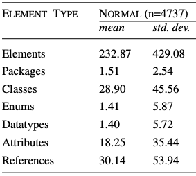
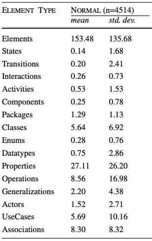

# Advance Deep Learning Course: Deep-UML-Modeling

## Leveraging Transformer-Based NLP for Ecore and Archimate Model Analysis

## Project Description

### Introduction

In the context of conceptual or domain modeling, the analysis and manipulation of UML models can support UML modelers create UML models, improve the existing UML models or even search within a repository of UML models.

In this project, I will use **Natural Language Processing** (NLP) as my topic. Due to the graph-based structure of UML models, I aim to use **Transformers** and **Graph Neural Networks** architecture, to address three tasks related to UML modeling language.
There has been work that is already done using traditional ML or even deep learning, therefore, I will be comparing my solution with the existing works.
The dataset is publicly available therefore my project type would be - **Bring your own Method**

### Objectives

The primary objectives of this project are as follows:
     
1. **Partial Model Completion, Model Element Recommendation, or Model Generation:**

   - Create a system that, given a partially constructed UML model, can suggest elements for that model based on the structural and linguistic information present in the model.
   - This task will involve a self supervised learning approach where I aim to learn to predict the next element of a UML model, from the dataset of UML models themselves
   - In this work, I will compare my solution with two existing works [2] and [3].

2. **Model Domain Classification:**

   - Develop a deep learning model that, given a UML model, can automatically classify Ecore models into its respective domain based on their content and structure.
   - This task will involve a supervised learning setting which would involve a labeled dataset [ModelSet](https://github.com/modelset/modelset-dataset) [5]
   - In this task, I will compare my results with two existing works i.e., [1] and [2]

3. **Requirements to UML model generation:**

   - Develop a sequence to sequence model that produces a (partial) UML model specification corresponding to a given set of requirements in natural language.
   - This is supervised learning problem which involves a dataset available [here](https://github.com/songyang-dev/uml-classes-and-specs)
   - In this task I aim to compare my solution with [4]

### About the Dataset

[ModelSet](https://github.com/modelset/modelset-dataset) consists of 9251 UML models, which are considered as typed graphs where each node and edge belong to a specific type. 
UML models elements i.e., the nodes and edges can belong to the ECore vocabulary or UML Papyrus vocabulary. 

 
*Fig. 1 UML Models with Ecore Vocabulary.*

Fig. 1 shows the distribution of different types of nodes for UML models that follow the Ecore Vocabulary, which means the nodes and edges will belong to only these types.

 
*Fig. 2 UML Models with Ecore Vocabulary.*
Fig. 2 distribution of different types of nodes for UML models that follow the Papyrus vocabulary.

### Methodology

To achieve the stated objectives, in this project I will train my own transformer models on the UML models dataset for the specific tasks but also would like to compare the performance of my approach, which is very specific to my data to UML models, with the exisiting state-of-the-art transformer-based NLP models, such as BERT, GPT, or RoBERTa that are trained on general text. The methodology consists of the following steps:

1. **Data Preprocessing:**

   - Convert UML models into a format that can be ingested by transformer-based models.
   - Tokenization and embedding of model elements, descriptions, and structural information.
     
2. **Model Training:**
   - I plan to train a transformer model for the first task which involves a sequence to sequence model. Once the model is trained for next element prediction, I aim to finetune the model on model domain classification and model clustering task.
   
3. **Model Evaluation:**

   - Assess the performance of the models using appropriate evaluation metrics for each task (e.g., accuracy, F1-score, or ranking metrics for recommendation).

### Expected Outcomes

The successful completion of this project will result in the following outcomes:

- An efficient classification of UML models based on their domain.
- A system that can provide recommendations for missing model elements and generate models based on user inputs.
- A requirements to UML model generator

[[1] López, José Antonio Hernández, et al. &#34;Machine learning methods for model classification: a comparative study.&#34; Proceedings of the 25th International Conference on Model Driven Engineering Languages and Systems. 2022.](https://dl.acm.org/doi/pdf/10.1145/3550355.3552461) 

[[2] López, José Antonio Hernández, Carlos Durá, and Jesús Sánchez Cuadrado. &#34;Word Embeddings for Model-Driven Engineering.&#34; 2023 ACM/IEEE 26th International Conference on Model Driven Engineering Languages and Systems 2022.](https://jesusc.github.io/papers/models23-worde4mde.pdf) 

[[3] Weyssow, Martin, Houari Sahraoui, and Eugene Syriani. &#34;Recommending metamodel concepts during modeling activities with pre-trained language models.&#34; Software and Systems Modeling 21.3 (2022): 1071-1089.](https://link.springer.com/article/10.1007/s10270-022-00975-5) 

[[4] Yang, Song, and Houari Sahraoui. &#34;Towards automatically extracting UML class diagrams from natural language specifications.&#34; Proceedings of the 25th International Conference on Model Driven Engineering Languages and Systems: Companion Proceedings. 2022.](https://dl.acm.org/doi/pdf/10.1145/3550356.3561592)

[[5] López, José Antonio Hernández, Javier Luis Cánovas Izquierdo, and Jesús Sánchez Cuadrado. "ModelSet: a dataset for machine learning in model-driven engineering." Software and Systems Modeling (2022): 1-20.](https://link.springer.com/article/10.1007/s10270-021-00929-3)
